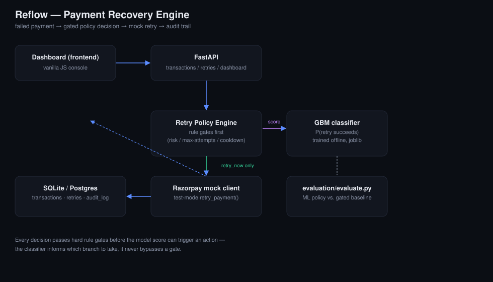

# Reflow — Revenue Recovery Engine

Built for the Razorpay AI Buildathon — **Track 03: AI Revenue Recovery**.

Reflow watches failed payments, works out why each one actually failed, and
decides what — if anything — to do about it: retry now, wait and retry
later, nudge the customer toward a different payment method, escalate to a
human, or give up cleanly. It's not "call an LLM and hope" — it's a small
gradient-boosted classifier for *should this succeed if we retry it*, wrapped
in hard rule gates the model is never allowed to override, with every step
of the pipeline — detect, diagnose, decide, act, observe — written to an
audit trail.

Payment failures are one of the most direct revenue-leak problems a gateway
company has. A meaningful chunk of "failed" transactions aren't actually
lost — the card had a blip, the issuing bank's server was down for 90
seconds, the OTP timed out. Retrying those recovers real money. Retrying the
rest (expired card, declined-for-fraud) just annoys the customer and burns
issuer trust in the merchant's retry behavior. The whole problem is telling
those two cases apart, cheaply, in real time, without ever letting a model
do something unsafe on its own — and being able to prove, after the fact,
exactly why each decision was made.

## The recovery loop

```
detect            every ingested failed txn is revenue at risk until it's
  │                resolved — tracked live in /dashboard/metrics

diagnose           failure_reason → root-cause bucket (customer-side,
  │                bank-side, issuer-side, fraud signal) — retry_engine.diagnose()

decide             hard rule gates first (risk flag, non-recoverable reason,
  │                retry cap, large-txn-repeat) → GBM model scores retry
  │                success probability → cooldown check → action

act                bounded: one of 5 actions, executed against the mock
  │                Razorpay client, never anything the gates didn't clear

observe            outcome captured from the (simulated) gateway response,
  │                written back to the transaction + retry_attempts row

stop / escalate    retry cap, large-amount-on-repeat, and risk flags all
  │                route to a human queue instead of auto-acting

measure            revenue at risk vs. recovered, recovery rate, unnecessary
  │                retries avoided, escalation rate — evaluation/evaluate.py

audit              every decision, gate, and outcome logged with an
                   explanation — /audit-log
```

## Why this design

I didn't want to build "LLM classifies error message, LLM decides everything."
That's an easy demo and a bad idea for something that touches money. Instead:

- **Gates come before the model.** Risk-flagged transactions, expired cards,
  anything past the retry cap — these get routed away before the classifier
  ever runs. See `NO_AUTO_RETRY_REASONS` / `MAX_AUTO_RETRIES` in
  `backend/app/retry_engine.py`.
- **Diagnosis is a deterministic lookup, not a model call.** `failure_reason`
  already tells you the root-cause bucket (customer-side / bank-side /
  issuer-side / fraud) — that's definitional, not something worth spending a
  classifier on. `retry_engine.diagnose()` is a static table. The model's job
  starts *after* diagnosis: given this specific failure, is a retry worth it.
- **The model only scores a narrow question**: given these features, what's
  the probability a retry succeeds? It doesn't pick the action, doesn't call
  the payment API, doesn't touch the DB. `decide()` does all of that, and
  it's deterministic and unit-testable independent of the model.
- **Idempotency is enforced at the action layer, not just the ingestion
  layer.** Ingesting the same `txn_id` twice already 409s, but the more
  realistic duplicate-action risk is a decide request getting retried by a
  flaky client or double-tapped in the UI. `POST /transactions/{id}/decide`
  accepts an `Idempotency-Key` header; replaying the same key against the
  same transaction returns the original result instead of firing the
  Razorpay call (or the escalation, or anything else) a second time. There's
  also a DB-level unique constraint on `(transaction_id, idempotency_key)` so
  two concurrent requests with the same key can't both win.
- **Every decision writes an audit entry** — action taken, why, which gates
  fired, model score if any, diagnosis. `/audit-log` shows the trail.
- **The "AI integration" earns its place**: without the model, the rule-only
  baseline (`retry_all_gated`) already retries safely, but it retries
  *everything* that clears the gates, including plenty that were never going
  to succeed. The model's job is picking out that low-probability tail and
  routing it away from a wasted attempt, without giving up revenue to do it.
  See [Evaluation](#evaluation) — that's a measured trade-off, not a claim.

## Architecture



```
frontend (vanilla JS)  →  FastAPI  →  retry_engine.decide()
                                          │
                              ┌───────────┴───────────┐
                       rule gates (no model)     GBM classifier
                       risk / expired / cap      P(retry succeeds)
                                          │
                                 razorpay_mock.RazorpayClient
                                          │
                              SQLite (transactions, retries, audit_log)
```

## Repo layout

```
backend/
  app/
    main.py              FastAPI app + router registration
    retry_engine.py       the actual decision logic (gates + model)
    razorpay_mock.py      test-mode retry simulator
    ground_truth.py       hidden recoverability function (data gen + mock gateway both use it)
    models.py / schemas.py / db.py
    ml/
      features.py         shared feature list (training + inference)
      train_model.py       trains + saves the classifier
      classifier.py        inference wrapper
      model.pkl            trained artifact (checked in so it runs out of the box)
    routers/
      transactions.py, retries.py, dashboard.py
  data/
    generate_synthetic_data.py
    transactions_sample.csv   6,000 synthetic failed-payment rows
  evaluation/
    evaluate.py            ML policy vs. rule-only baseline, on held-out data
    metrics_output.json    output of the last run (checked in, reproducible)
  tests/
    test_retry_engine.py, test_classifier.py, test_razorpay_mock.py, test_api.py, test_seed.py
  seed_demo_data.py        manually (re-)loads sample rows into a running instance -
                            not required anymore, see "Demo data" below
  app/seed.py               auto-seeds demo fixtures on startup if the DB is empty
  requirements.txt, Dockerfile, .env.example
frontend/
  index.html, dashboard.js, styles.css, Dockerfile
  ops console: KPI row (revenue at risk/recovered, recovery rate, escalations,
  avoided unnecessary retries), transaction table with drill-down into the
  full detect → diagnose → intervene → execute → observe pipeline for that
  transaction, strategy performance, model performance + baseline comparison,
  live audit feed
docs/
  architecture.svg
docker-compose.yml          local dev: backend (:8000) + nginx-served frontend (:8080)
Dockerfile                  repo-root - single-service image for deployment,
                             see "Deployment" below
```

## Demo data

The deployed demo (and a fresh `docker compose up`, and a plain clone with no
`.env`) all start with an empty database. Rather than requiring anyone to run
a manual seed script before there's anything to look at, `app/main.py` calls
`app/seed.py` on startup: if the transactions table is empty, it loads four
hand-picked transactions - one per recovery action, chosen so a judge can
reliably click through all four decision paths (`retry_now`,
`stop_no_retry`, `escalate_human`, `suggest_alt_method`) without hunting for
one that happens to trigger each - plus 40 more rows sampled from
`data/transactions_sample.csv` for volume. These are demo fixtures, clearly
labeled as such in the source; running `/decide` on them still calls the
real retry engine, they're just chosen to land on a specific outcome given
the current gates/model. `seed_demo_data.py` (the original manual script)
still works if you want to re-seed a running instance with a different `--n`
by hand.

## Running it

### Local (no Docker)

```bash
cd backend
python -m venv .venv && source .venv/bin/activate
pip install -r requirements.txt

# model.pkl is already checked in, but if you want to retrain from scratch:
python data/generate_synthetic_data.py --n 6000
python -m app.ml.train_model

cp .env.example .env
uvicorn app.main:app --reload --port 8000
```

The dashboard has data as soon as the server starts (see "Demo data" above)
- no separate seed step needed. Then open `frontend/index.html` directly in
a browser (or serve it with `python -m http.server 8080` from `frontend/`),
and click a row to run the agent on it. The API field defaults to
`http://localhost:8000` automatically when the frontend is opened this way.

### Docker (local dev - two containers)

```bash
docker compose up --build
```

Backend on `:8000`, frontend on `:8080`, dashboard pre-populated on first
boot. This is the local-dev layout: two containers, matching the repo's
`backend/` + `frontend/` split.

### GitHub Codespaces

Same two commands as above:

```bash
docker compose up --build
```

Codespaces auto-forwards ports `8000` and `8080` and gives each one its own
URL (`https://<name>-8080.app.github.dev`, etc. - check the **Ports** tab).
Open the forwarded `8080` URL, not `localhost:8080` - `dashboard.js`
detects it's running on a Codespaces forwarded domain and automatically
points the API field at the forwarded `8000` URL instead of `localhost`
(which wouldn't be reachable from your browser). Nothing to configure by
hand. If port `8000` is set to **Private** visibility (the Codespaces
default), that's fine for your own testing in the same browser session -
you only need to make it **Public** if you want to share the Codespace URL
with someone else.

## Deployment

The deployed demo uses a **different, simpler single-service image**
(`Dockerfile` at the repo root) rather than the two-container
docker-compose layout above - one FastAPI process serves both the API and
the static frontend from the same origin, so there's exactly one public
URL, no CORS configuration to get right, and no risk of the two halves
being deployed out of sync. `app/main.py` mounts the frontend as static
files only if `FRONTEND_STATIC_DIR` exists in the image; the local-dev
backend image doesn't have that directory, so this doesn't change local
dev at all.

**Recommended platform: Render** (free tier, native Dockerfile support,
automatic HTTPS, no CLI required).

1. Push this repo to GitHub (see "Git" below if it isn't already).
2. Go to [dashboard.render.com](https://dashboard.render.com) → **New +**
   → **Web Service**.
3. Connect the GitHub repo.
4. Render should auto-detect the root `Dockerfile`. If asked:
   - **Root Directory**: leave blank (repo root)
   - **Dockerfile Path**: `Dockerfile`
   - **Docker Build Context Directory**: `.`
5. **Instance Type**: Free.
6. Environment variables (Render → Environment tab) - all optional, sane
   defaults are already baked into the Dockerfile:
   - `CORS_ALLOW_ORIGINS` - leave as `*` (same-origin deploy doesn't need
     CORS at all, but the default is harmless)
   - `DEMO_SEED_ON_STARTUP` - leave as `1` (default) so the dashboard is
     never empty
7. Click **Create Web Service**. First build takes a few minutes (installs
   deps, trains the model). Render gives you a URL like
   `https://reflow-xxxx.onrender.com` - HTTPS by default.
8. Open that URL. That's the whole demo - API and frontend, one link.

**Notes:**

- Render's free tier spins the service down after ~15 minutes of
  inactivity; the first request after that takes ~30-50s to cold-start.
  Warn a judge if they hit that.
- Free tier has no persistent disk, so the SQLite file resets on every
  restart/redeploy - by design here, since `app/seed.py` re-populates it
  automatically on boot (see "Demo data"). Any transactions a judge
  triggers manually during their session persist for that session but
  won't survive a cold-start restart. If you want state to persist across
  restarts, add a Render persistent disk mounted at `/app/data_volume` and
  set `DATABASE_URL=sqlite:///./data_volume/reflow.db` (optional - not
  required for judging).
- **I have not been able to actually execute a deployment from this
  environment** (no network access to Render/Railway/etc. here, and no
  Docker daemon available to run `docker build` locally to double check
  the image builds end-to-end). Everything above was verified a different
  way: I reproduced exactly what the root `Dockerfile` does - installed
  `requirements.txt`, trained the model, copied `frontend/` next to the
  backend, and ran `uvicorn` with `FRONTEND_STATIC_DIR` set to that
  copy - and confirmed the running server serves the frontend at `/`,
  serves `dashboard.js`/`styles.css`, answers `/health`, and auto-seeds all
  four demo transactions on first boot with `/dashboard/metrics` reflecting
  it correctly. That's the same code path Docker would run; I just didn't
  route it through an actual `docker build`. Please run
  `docker build -t reflow . && docker run -p 8000:8000 reflow` once
  yourself before the deadline to be certain the container build itself
  is clean in your environment.

If you'd rather deploy frontend and backend as two separate services (e.g.
Render static site + Render web service), the existing `frontend/Dockerfile`
and `backend/Dockerfile` still work for that - just set
`CORS_ALLOW_ORIGINS` on the backend to the frontend's exact URL, and type
that backend URL into the API field on the frontend page.

## API

| Endpoint | What it does |
|---|---|
| `POST /transactions` | ingest a failed payment (409 on duplicate `txn_id`) |
| `GET /transactions` | list transactions, optional `?status=` filter |
| `GET /transactions/{txn_id}` | single transaction |
| `POST /transactions/{txn_id}/decide` | run the recovery agent on one transaction. Optional `Idempotency-Key` header |
| `GET /transactions/{txn_id}/retries` | retry attempt history for one transaction |
| `GET /audit-log` | full decision audit trail |
| `GET /dashboard/metrics` | revenue at risk/recovered, recovery rate, escalations, strategy performance, model + baseline metrics |

Interactive docs at `http://localhost:8000/docs` once the server's running.

## The five actions

`retry_now` · `delay_retry` (cooldown active) · `suggest_alt_method` (issuer
declines often clear on a different rail) · `escalate_human` (risk flag, over
retry cap, or large amount on a repeat attempt) · `stop_no_retry` (not
recoverable by retrying, or model score too low to justify another attempt).

## Evaluation

There's no public dataset of real Razorpay failure/retry outcomes (for
obvious reasons), so `backend/data/generate_synthetic_data.py` builds
synthetic transactions and labels each one using a hidden ground-truth
recoverability function — things like "UPI retries succeed slightly more
than card," "retrying a bank-server-down failure within 5 minutes rarely
helps, waiting 30+ does," "large transactions face more issuer scrutiny."
That function lives in `app/ground_truth.py`. The model never sees it,
only the sampled features and the resulting outcome — same as it would
with real production data. The live demo's mock Razorpay client
(`app/razorpay_mock.py`) calls the exact same function to decide whether a
retry clears, using the transaction's real features, not the model's own
prediction — otherwise a "confident" model would just be inflating its own
success rate, and the whole evaluation would be measuring the model
agreeing with itself.

`backend/evaluation/evaluate.py` scores three policies on the held-out 20%
split (never seen during training):

- `retry_all` — no gates, no model, retry everything
- `retry_all_gated` — same hard safety gates as Reflow, but no ML score
  (the honest baseline — isolates what the model actually adds on top of
  the gates, rather than comparing against a strawman)
- `reflow_ml_policy` — the full engine

Latest run (`backend/evaluation/metrics_output.json`, n=1,200 held-out rows,
₹14.29L revenue at risk in that split):

| Policy | Retry rate | Success rate when retried | Unnecessary retries | False-positive cost | Revenue recovered |
|---|---|---|---|---|---|
| retry_all | 100% | 49.6% | 605 | ₹4,840 | ₹645,154 |
| retry_all_gated | 86.1% | 55.5% | 460 | ₹3,680 | ₹629,206 |
| **reflow_ml_policy** | 80.3% | **58.1%** | **404** | **₹3,232** | ₹623,109 |

Against the honest baseline (gates alone, no model), Reflow recovers
**99.0% of the same revenue** (₹623,109 vs. ₹629,206 — a ₹6,098 gap) while
making **56 fewer retry attempts that were never going to succeed** (a
**12.2% cut** in unnecessary retries) and a **higher hit rate when it does
retry** (58.1% vs. 55.5%). That's the actual trade-off this system is
built around: the model isn't there to chase a bigger gross-recovery number
by retrying more aggressively than the rules alone already do — it's there
to get almost the same revenue back with meaningfully less waste, because
every unnecessary retry is a declined-again charge attempt against the
customer's bank, which is exactly the kind of thing that gets a merchant's
retry privileges throttled by issuers. `MIN_PROBA_TO_RETRY` in
`retry_engine.py` is the tunable knob for this trade-off — set low enough
that the model only turns down the transactions it's genuinely unsure
about, not just the ones scoring under a comfortable 50%. The eval script
makes that trade-off visible instead of hiding it behind a single "accuracy"
number.

**Classifier confusion matrix at the production threshold (0.20, not the
default 0.5)** — this is the number that actually matters, since the
default-threshold metrics in `train_metrics.json` don't reflect the
threshold Reflow ships with:

| | Predicted retry succeeds | Predicted retry fails |
|---|---|---|
| **Actually succeeds** | TP 561 | FN 34 |
| **Actually fails** | FP 419 | TN 186 |

Precision 0.572, recall 0.943, f1 0.712, accuracy 0.623. A low threshold
trades precision for recall on purpose here — at 0.20, the model is tuned
to almost never turn down a transaction that would have actually succeeded
(94% recall), accepting more false positives in exchange, because a false
positive only costs a cheap wasted attempt while a false negative gives up
real revenue outright. It's not a 9-nines demo number — it's what a GBM on
8 tabular features gets you when it's tuned for the actual cost asymmetry
of this problem, and it's still enough to meaningfully outperform gate-only
rules on wasted attempts.

To reproduce everything above from scratch:

```bash
cd backend
python data/generate_synthetic_data.py --n 6000   # optional, data is checked in
python -m app.ml.train_model
python -m evaluation.evaluate
```

## Tests

```bash
cd backend
python -m pytest tests/ -v
```

26 tests covering: rule-gate correctness (risk flags never auto-retry, expired
cards never retry, retry cap is enforced, large repeat-attempt transactions
escalate instead of auto-retrying), diagnosis attaches on both the gate path
and the model path, idempotency-key replay (same key → no second retry
attempt, no double gateway call; different key → treated independently),
classifier sanity checks, full API integration tests against a temp SQLite
DB, that a delayed retry actually resolves once its cooldown really elapses
(not just re-runs the same decision forever), and that the mock gateway's
outcomes track the hidden ground-truth function rather than any prediction
handed to it.

## Failure handling

- Mock Razorpay client raises a simulated 2% gateway-timeout rate — caught in
  `routers/retries.py`, logged to the audit trail, transaction left in
  `failed` status rather than silently marked resolved.
- The mock gateway's outcomes come from `app/ground_truth.py`, applied to
  the transaction's real features — never from the model's own prediction.
  A retry the model scored at 90% can still fail against the mock, same as
  it could against a real bank; the model informs the decision, it doesn't
  get to grade its own homework on the outcome.
- `decide()` never throws on bad/missing gate data — falls through to the
  model, and the model wrapper raises a clear error at import time if
  `model.pkl` is missing, instead of failing silently on the first request.
- Duplicate `txn_id` ingestion returns `409`, not a silent overwrite.
- Resolved transactions (`recovered` / `given_up`) can't be re-decided —
  `400` if you try, so the agent can't double-charge or loop.
- Duplicate *actions* (not just duplicate ingestion) are caught via the
  `Idempotency-Key` header on `/decide` — a replayed request with the same
  key returns the original decision instead of re-running it, and a DB
  unique constraint on `(transaction_id, idempotency_key)` closes the race
  where two concurrent requests carry the same key.
- Model uncertainty is handled by threshold, not ignored: below
  `MIN_PROBA_TO_RETRY` the engine won't auto-retry regardless of how the
  gates went, and routes to `suggest_alt_method` or `stop_no_retry` instead.
- Large transactions on a repeat attempt (`amount > ₹100,000` and
  `attempt_no > 1`) are hard-gated to `escalate_human` — the model never
  gets a vote on whether to auto-act on a large sum a second time.
- `delay_retry` isn't a dead end: each transaction tracks `last_failure_at`,
  and `/decide` recomputes `minutes_since_last_failure` from that anchor on
  every call instead of trusting a number frozen at ingestion. Call `/decide`
  again once the cooldown window has actually passed and the engine
  re-evaluates with the real elapsed time — it'll either retry, or (if the
  retry then fails) push the transaction toward escalation as the attempt
  count climbs. A failed retry resets that clock too, since it's a fresh
  failure event.

### End-to-end scenario worth walking through in a demo

Ingest a ₹180,000 transaction with `failure_reason=network_timeout`,
`attempt_no=1`. First decide: passes the gates, model scores it, likely
`retry_now` or `delay_retry`. If it fails and comes back as `attempt_no=2`
in the same amount range, the *second* decide call hits the
`large_txn_repeat_attempt` gate and goes straight to `escalate_human` —
the same transaction, same failure reason, different outcome, because the
system's own action history changed the risk profile. Pull `/audit-log`
for that `txn_id` afterward and you can see the full trace: attempt 1's
model-driven retry, its outcome, and attempt 2 getting pulled out of
automation entirely. That's the demo — not "the model got it right," but
"the system knows when to stop trusting the model."

## Limitations

Being upfront about what this is and isn't, for a judge or anyone else
evaluating it:

- **All data is synthetic.** `data/transactions_sample.csv` is generated by
  `data/generate_synthetic_data.py` from a hand-authored ground-truth
  function (`app/ground_truth.py`), not real Razorpay transactions. The
  metrics in "Evaluation" below are real numbers, but they're real numbers
  *on synthetic data* - they demonstrate the approach, not a production
  recovery rate.
- **The payment gateway is mocked.** `app/razorpay_mock.py` simulates
  Razorpay's request/response shape and a randomized outcome; there is no
  live Razorpay integration, no real card/UPI/netbanking rail, and no money
  actually moves. See "What I'd add with more time" for what a real
  integration would need.
- **This is a demo environment, not production payment infrastructure.**
  No auth on the API, SQLite instead of a real database, no rate limiting,
  no PCI-relevant handling (there's no real card data to handle, since
  nothing here is real). Don't point a live payment flow at this.
- The ML model is a GBM trained on 8 tabular features from 6,000 synthetic
  rows - deliberately small and simple, not a claim that a bigger model
  wouldn't do better with real data.

## What I'd add with more time

- Real `razorpay-python` SDK integration behind the same `RazorpayClient`
  interface (the mock's method signature was written to match it).
- Webhook listener for actual async payment status updates instead of the
  synchronous mock call.
- A slightly bigger/more realistic feature set (device fingerprint, issuer
  BIN ranges) — kept it to 8 features here since that's what's honestly
  available without a real payments dataset to mine correlations from.
- Postgres in the compose file for anything beyond a demo — SQLite's fine
  for this scale but I wouldn't ship it past a prototype.
- Diagnosis is currently a static lookup table (`DIAGNOSIS_BY_REASON`). For a
  real merchant integration, `failure_reason` itself would need to be
  *inferred* from raw gateway error codes/messages, which is a genuinely
  harder NLP-ish problem — that's a good place an LLM would actually earn
  its keep, classifying free-text gateway errors into the same fixed bucket
  set, still with no ability to act.
- The `Idempotency-Key` is currently caller-supplied and optional; a
  production version would generate and return one on the first decide call
  so clients don't have to invent their own scheme.
